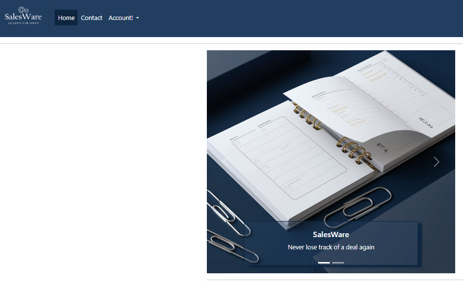
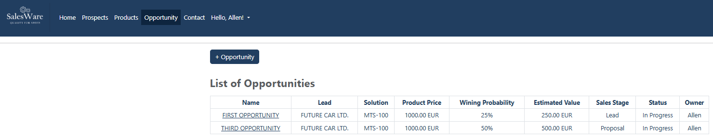

# SalesWare User Manual

**Welcome to SalesWare User Manual**. 

After the brief introduction about SalesWare, you are now set to get a deep dive into how to use SalesWare. This manual is divided into seven sections. By the end of these sections, you should be comfortable using our solution.

Before start working with SalesWare, you need first to sign up for SalesWare as a new user. The first section explains all the steps that you need to follow to become a SalesWare User.

---
## 1.1 Sign Up

In order to start using SalesWare, you need first to sign up for our service. First, you need to go to SalesWare **Home** page. You then click on **Account!** dropdown menu.
Please see the image below.

Now please click on **Sign Up** within the dropdown menu. This will take you then to the **Sign Up** page. See the image below.

Please enter now your **Username once**, and your **password twice** as shown below.

Once you have done so, please click on **Sign Up** button. The website will take you back to the **Home** page an indication that you have successfully signed up. You will notice that all Salesware components are open to you now. This includes the appearance of your **Username** atop the dropdown menu. 

Before we introduce you the main components of SalesWare, we ask you please for some patient. We need to make you aware of how to sign out of SalesWare in case you need to do so in the future. Therefore, the next section will explain to you how to do just that.

---
## 1.2 Sign Out

In order to sign out of SalesWare, first you need to click on the **dropdown menu** once again. As shown below

Now click please on **Sign Out**. If you have done so, the website will take you to the **Sign Out confirmation** page.

If you are sure about signing out, then please click on the **Sign out** button. This then will take you back to the **Home** page. Atop of the dropdown menu, you can see that your name disappeared and instead you see now **Account!**.

Now you know how to sign up and sign out, we are ready to explain to you how to work with all SalesWare components. So let's get started by first signing you in you again as a user of SalesWare.

---
## 1.3 Sign In

We start from where we left in the last section. In the **Home** page, please click on the **Account!** dropdown menu.

Click on **Sign in**. This will take you then to the **sign in page**. Please add your **username** and **password** you used when you signed up to SalesWare as shown below.

Once you have entered your username and password, please click on **Sign In** button. The website will take now to the **Home** page.

Great! We are now all set to start with the first component of SalesWare, **Prospect Management**.

---
### 1.4 Prospect Management

In **Prospect Management**, you will be able to add, delete or edit your prospect. You can also see all your prospect records on one page. This section is therefore is divided into three subsections, these are add prospect, edit prospect and finally delete prospect.

> **_Note_** Please refer back to the definition of [Prospect](./README.md#prospect-a-prospect-is-an-external-firm-that-is-interested-in-one-or-more-of-the-organization-offerings) if you need some refreshment about SalesWare term definitions.

### 1.4.1 Add New Prospect

In this section we will take you through the steps you need to follow to create new prospect. First, you need to go to the **Prospect** page as shown in the image below.

Once you landed on the **Prospect** page, please click on **+Prospect** button. This will open a popup window for creating new prospect. 

Please provide all the required information as shown in the following image.

Now Click on **Create** button. Another popup window will open confirming to you that the prospect is created, see the image below.

Close the window to go back to the **Prospect** page. In the **Prospect** page, you will find your new prospect now is listed with its main fields.

*Now after you have created the prospect, you noticed that one or more fields are not correctly entered. So you decide to edit the prospect to reflect the correct information*. To do that, we have dedicated another subsection to explain to you how to edit a prospect.

### 1.4.2 Edit Prospect

In order to edit one or more fields of your prospect, you need first to open the targeted prospect. You can do so by going to **Prospect** page as shown below.

Please click on prospect **Company** name you want to edit. This will open a popup window that shows all the fields of your prospect. Now enter the new information into the respective field(s) you want to update or change as shown in the following image.

Once you all set, click please on **Update** button. A popup window will show up confirming that the prospect is updated. See the image below.

Close the window to automatically go back to the **Prospect** page. In the **Prospect** page, you will find your prospect is now listed with updated fields information.

In the last subsection, we will introduce you to deleting prospect procedure.

### 1.4.3 Delete Prospect

In order to delete a prospect, you need first to open the targeted prospect. You can do so by going to **Prospect** page as shown below.

Please now click on prospect **Company** name you want to delete. This will open a popup window that shows the prospect detail. as shown in the following image.

Now click please on the **Delete** button. A popup window will show up asking you if you want to proceed with the delete action. See the image below.

Now confirm the action by clicking on the **Confirm** button. A new popup window will show up informing you that the delete action is successful. See the image below.

Close the window to automatically go back to the **Prospect** page. You will see that your prospect is erased from the list.

Now you know how to create/edit/delete a prospect. In the next section, we will explain to you how to work with the second component of SalesWare which is the **Product Management** component.

---
### 1.5 Product Management

In **Product Management**, you are able to add, delete or edit your product. You can also see all your product records on one page. This section is therefore is divided into three subsections, these are add product, edit product and finally delete product.

> **_Note_** Please refer back to the definition of [Product](./README.md#product-a-product-is-one-of-the-organization-offerings-it-can-be-either-a-product-or-a-service) if you need some refreshment about SalesWare term definitions.

### 1.5.1 Add New product

In this section we will take you through the steps to create new product. First, you need to go to the **Product** page as shown in the image below.

Once you landed on the **Product** page, please click on **+Product** button. This will open a popup window for creating new product. 

Please provide all the required information as shown in the following image.

Now Click on the **Create** button. Another popup window will open confirming to you that the product is created, see the image below.

Close the window to automatically go back to the **Product** page. In the **Product** page, you will find your new product is now listed with its main fields.

*Now after you have created the product, you noticed that one or more field are not correctly entered. You decide to edit the product field to reflect the correct information.* To do that, we have dedicated another subsection explaining how to do just that.

### 1.5.2 Edit Product

In order to edit one or more fields of your product, you need first to open the targeted product. You can do so by going to **Product** page as shown below.

Please click on product name you want to edit. This will open a popup window that show all the fields of your product. Now enter the new information into the respective field(s) you want to update or change as shown in the following image.

Once you all set, click please on the **Update** button. A popup window will show up confirming that the product is updated. See the image below.

Close the window to automatically go back to the **Product** page. In the **Product** page, you will find your product is now listed with updated fields.

In the last subsection, we will introduce you to the deleting product procedure.

### 1.5.3 Delete Product

In order to delete a product, you need first need to open the targeted product. You can do so by going to **Product** page as shown below.

Please now click on the product **Name** you want to delete. This will open a popup window that show the product detail. as shown in the following image.

Now click please on the **Delete** button. A popup window will show up asking you if you want to proceed with delete action. See the image below.

Now confirm the action by clicking on the **Confirm** button. A new popup window will show up informing you that the delete action is successful. See the image below.

Close the window to go back to the **Product** page. You will see that your product is erased from the list.

Now you know who to create/edit/delete a product. In the next section, we will explain to you how to work with SalesWare third component, the **Opportunity Management**.

---
### 1.6 Opportunity Management

In **Opportunity Management**, you are able to add, delete or edit your opportunity. You can also see all your opportunity records on one page. This section is therefore is divided into three subsections, these are add opportunity, edit opportunity and finally delete opportunity.

> **_Note_** Please refer back to the definition of [opportunity](./README.md#opportunity-an-opportunity-is-a-chance-of-selling-the-defined-product-to-the-defined-prospect) if you need some refreshment about SalesWare term definitions.

### 1.6.1 Add New Opportunity

In this section we will take you through the steps to create new opportunity. First, you need to go to the **Opportunity** page as shown in the image below.

Once you landed on the **Opportunity** page, please click on **+Opportunity** button. This will open a popup window for creating new opportunity. 

Please provide all the required information as shown in the following image.

Now Click on the **Create** button. Another popup window will open confirming to you that the opportunity is created, see the image below.

Close the window to automatically go back to the **Opportunity** page. In the **Opportunity** page, you will find your new opportunity is now listed with its main fields.

*Now few days later, you submitted a proposal to Future Car with complete offer. You want now to update the opportunity to reflect this development. You also want now to qualify the opportunity to Proposal stage.* To do that, we have dedicated another subsection explaining how to do just that.

### 1.6.2 Edit Opportunity

In order to edit one or more fields of your opportunity, you need first to open the targeted opportunity. You can do so by going to **Opportunity** page as shown below.

Please click on opportunity **Name** you want to edit. This will open a popup window that show all the fields of your opportunity. Now enter the new information into the respective field(s) you want to update or change as shown in the following image.

Once you all set, click please on the **Update** button. A popup window will show up confirming that the opportunity is updated. See the image below.

Close the window to go back to the **Opportunity** page. In the **Opportunity** page, you will find your opportunity is now listed with updated fields.

In the last subsection, we will introduce you to the deleting opportunity procedure.

### 1.6.3 Delete Opportunity

In order to delete a opportunity, you need first to open the targeted opportunity. You can do so by going to **Opportunity** page as shown below.

Please now click on opportunity **nName** you want to delete. This will open a popup window that show the opportunity detail, as shown in the following image.

Now click please on the **Delete** button. A popup window will show up asking you if you want to proceed with delete action. See the image below.

Now confirm the action by clicking on the **Confirm** button. A new popup window will show up informing you that the delete action is successful. See the image below.

Close the window to automatically go back to the **Opportunity** page. You will see that your opportunity is erased from the list.

Now you know how to create/edit/delete a opportunity. You are now have full knowledge to work with the main components of SalesWare. The last section explains how you can contact us in case you need any technical or non-technical support by using our **Contact** page. The **Contact** page is part of the last component of SalesWare, the Communication Management.

---
## 1.7 Communication Management

The last component of SalesWare is the **Communication Management**. The **Communication Management** is divided into two different pages. Each serves a specific purpose. These are the **Home** Page and **Contact** Page. As a user you will be more concerned with the **Contact** page, since the **Home** page does not serve you much once you are our customer except as a landing page to sign in to **SalesWare**. We have already touched a bit on how to navigate to the sign in page via the **Home** page. Hence, we will not cover it in this section.

### 1.7.1 Contact Page

The purpose of the **Contact** page is to allow you establish a communication channel with SalesWare support team. In order to do so, you need first to navigate to the **Contact** page. On the **Contact** page please click on **Sign in!** dropdown menu and then click on **Contact** as shown below.

The **Contact** page will open with a form. You need to fill the form completely with a description of your request. Please see the image below.

Now fill out the form. **Please do not leave any field empty before submission**.

Now the form is set, click on the **Send** button to submit your request. Once you do so, a confirmation message will popup informing you that your message is sent successfully. You will also receive an email from our support team to confirm the reception of your message. Please see the image below.

Please close the the popup window now. The website will automatically take you back to the **Home** page.

---
**This concludes the User Manual. For any questions or inquiries please do not hesitate to contact us through our [Contact](https://sales-ware-7d441e6db481.herokuapp.com/contact/) page.**

> Sincerely Yours,\
SalesWare Support Team

[Go Back](README.md)