# SalesWare

**SalesWar** is a sales process software tool. It aims to digitalize the sales activity in order to boost the productivity of your sales team.
The market entry of **SalesWare** is small businesses and startups. More specifically, those businesses that:
 - are neither content with using excel sheets to track their sales activity due to complexity and generality.
 - nor can offered the subscription fees of the established Software tools like Microsoft Dynamic or SalesForce.

**SalesWare** is built as a foundational module of a Customer Relationship Management (CRM) software. The envisioned CRM then represents the ultimate vision of this project. This vision includes other modules like MarketingWare, ServiceWare, SupportWare and DataWare. Moreover, each of those modules will integrate Data Analytics to bring additional value to our users.

**SalesWare** in its current state should not be viewed as a solution that promises all the expected features an established sales process tool or a CRM tool is assumed to have. But rather as a minimum viable product (MVP) with the main purpose of getting the Author at the door step of potential buyers. Through their feedbacks and unique sales process, **SalesWare** can be further developed to evolve into much more sophisticated sales tool.

## 1 Introduction

SalesWare is developed to help sales team to digitalize their sales process and track opportunities progress. In this introduction, the user will find all the required information to start working with the SalesWare.

In this section, we provide you with all the information required to use our solution, SalesWare. First we define the important terms and then provide a complete user manual which will help you start working with SalesWare.

### 1.1 Getting Started

Before embarking on how to use the tool, SalesWare user must be acquainted with few terms. These terms are organization, admin, user, prospect, product and opportunity.

#### Organization:
An organization is an owner of SalesWare license. This organization consists of multiple departments. The ultimate user of the SalesWare within this organization is the Sales Department team members.

#### Admin:
The admin is a member of the organization Sales department. The admin has unlimited user permissions over the SalesWare application. To add some colors, the admin is the Head of Sales Department, or any other title that is responsible for the sales team of that organization.

#### User:
A user is a member of the organization sales department with limited user permission. Most likely, the user is a sales manager, business developer etc.

#### Prospect:
A prospect is an external firm that is interested in one or more of the organization offerings.

#### Product:
A product is one of the organization offerings. It can be either a product or a service.

#### Opportunity:
An opportunity is a chance of selling the defined product to the defined prospect.

Since the main terms now are established, we can provide some detail about the software main components. In the current version, SalesWare comes with four main components. These are:

- **Prospect Management:**\
  The prospect management concerns with the listing/reading/creating/updating/deleting a prospect record.
- **Product Management;**\
  The prospect management concerns with the listing/reading/creating/updating/deleting a product record. 
- **Opportunity Management:**\
  The Opportunity Management concerns with the listing/reading/creating/updating/deleting an opportunity record.  
- **Communication Management:**\
  This Communication Management provides a communication means between SalesWare and its customer/users. 

  More information on each of the four component is provided in the next section. We will also explain how these terms and components are implemented and used to track your sales deals in addition to how to sign up, sing in and sign out of SalesWare.

### 1.2 SalesWare User Manual

The SalesWare User Manual is available on the following link: [User Manual](MANUAL.md)

## 2 Planing

### 2.1 Project Objective

This section is devoted to explain the rational behind developing SalesWare. It aims to answer the following questions:

Why SalesWare?
What drives the author to develop SalesWare?
Why the user should care about using SalesWare?

Sales activity is one of the main activities of any businesses. It produces important metrics of any organization. Senior-level executives use those metrics to analyze and evaluate the firm's health, competitions, product demands etc.. In addition, sales forecast drives most of the firm's future plans that touch upon every aspect of a business.

Having a sales software that collects, stores and present such data like, customers' data, firm's offerings, opportunities tracking, historical sales data, customer acquisition metrics and sales pipeline is , therefore, of a great help to the firm decision makers.

The Software As A Service (SAAS) has taped into this need. We witnessed in the last couple of decades an explode in the number of Sales tools and CRM systems. Yet, there is still a nontrivial number of organizations, small businesses and startups, use excel sheets or similar products to track and record their sales activity. This is due to the fact that the license cost of the sophisticated SAAS solutions are quite high making it a burden on those small businesses to acquire.

On the other hand, tools like excel sheets are not designed to serve sales people. They are built for general purposes, hence they are not easy to use. Furthermore, the customization of such tools comes with high cost. In addition, any change to the firm sales activity in terms of process, business rules or metrics will lead to massive adaptation cost.

All that led the author to consider developing a sales tool that can support those businesses by providing an affordable sales activity-tailored solution.

### 2.2 Design Concept

The design concept of SalesWare is based on the general Reference Model used to develop an information system. This reference model is widely used in the enterprise architecture design. The adopted Reference Model core layers are Process, Data and application layers. The other two layers are the strategy and the infrastructure. The former is briefly explained in the previous section. It involves the strategic rational behind developing and/or integrating an enterprise solution to the business operation. The latter layer is the infrastructure layer. It is concerned with the infrastructure required to build and integrate the information system (solution). This layer is out of this project scope.

The following subsections aim to provide a detailed account of the main three layers mentioned above to shed some light on how the solution is designed.

#### 2.2.1 Process

The process layer covers the procedure of a specific activity within a firm's value chain. It is the corner stone of developing any enterprise information system solution. Hence, the author first has devised a generic sales process. This process is devised to help the development of the MVP. **SalesWare** *can be adapted to assume any other sales process upon a request from the user*.

The devised sales process is shown in the figure below.

By establishing the process, the main entities and business rules can easily be extracted. Those entities and business rules are essential to design the data model, the logic to be implemented into the code and also to extract the general requirements of the application. For instance, one can observe that there are four entities that are essential to this business scenario. These are Prospect, Product and Opportunity. In addition, one can notice, that the process goes into different stages these are Lead, Proposal, Negotiation and finally Close. The process is said to be Closed if it is a Won or Lost. Such information are crucial to the development of the logical data model which is the subject of the next subsection.

#### 2.2.2 Data

This section is devoted to present the data model of SalesWare. The Data Model is built to reflect the business process described in the Process subsection. The data model implemented is depicted in the figure below.

#### 2.2.3 Application

The application layer is the last layer of the reference model. In the context of this project, the author first extracts only a list of high-level requirements of the application based on the outcomes of the process and data layers. Then the author uses this list as the basis for creating the Epics and breaks down those Epics into a comprehensive list of user stories. The list of the high-level requirements are listed below .

- Account Management Capability\
  Sign in, sing out and sign up, admin user with unlimited permissions, users with limited permissions, 
- Prospect Management Capability\
  read/create/update/delete of prospects
- Product Management Capability\
  read/create/update/delete of product
- Opportunity Management Capability\
  read/create/update/delete of opportunity
- Communication Management Capability\
  Means of communication between user/visitor and the software developer

##### 2.2.3.1 Epics and User Stories

Agile methodology is used to develop the Software. The high-level requirements presented in the previous section are followed to define the five Epics of the project. Those Epics are then broke down into 32 User Stories.

**Epic SW-1 Account Management**\
*Description:* A set of features that allows the site visitor to create user accounts and for the user to access and use the application features. Additionally, this part also concerns with dedicated features for the admin account.

  - **Register a User account**
    - As a Site Visitor, I can register as User so that I can log in securely into the website.
  - **Store login information**
    - As a Site User, I can store my login information securely so that I can logout and login again into the website.
  - **Admin User Account**
    - As a Site Admin, I can see all the Users so that I can control who has access to the software.
  
**Epic SW-2 Prospect Management**\
*Description:* A set of features that allows the users to manage prospects entry.

  - **Create Prospect Entry**
    - As a Site User, I can create a new Prospect so that I can save it in the database.
  - **Open and Read Prospect Entry**
    - As a Site User, I can click on a Prospect name so that I can open and read its information.
  - **Edit Prospect Entry**
    - As a Site User, I can edit the Prospect information so that I can save any updated information about the prospect.
  - **Delete Prospect Entry**
    - As a Site User, I can delete the Prospect so that I can remove it from the database.
  - **Prospect Name Case Sensitive**
    - As a User, I can always save the prospect name in upper case in DB, so that I can not accidentally duplicate the name if I entered it as a whole or partially in lower case.
  - **Prospect Page**
    - As a Site User, I can view all the prospect in a dedicated page so that I can view all the prospects in an excel sheet-like display.

**Epic SW-3 Product Management**\
*Description:* A set of features that allows the users to manage product entry.

  - **Products Page**
    - As a Site User, I can view all the products in a dedicated page so that I can view all the products in an excel sheet-like display.
  - **Create Product Entry**
    - As a Site User, I can create a new Product so that I can save it in the database.
  - **Open and Read Product**
    - As a Site User, I can click on the Product name so that I can open and read its information.  
  - **Edit Product Entry**
    - As a Site User, I can edit the product information so that I can save any updated information about the product.
  - **Delete Product Entry**
    - As a Site User, I can delete the product so that I can remove it from the database.
  - **Product Name Case Sensitive**
    - As a User, I can always save the product name in upper case in DB, so that I can not accidentally duplicate the name if I entered it as a whole or partially in lower case.
    
**Epic SW-4 Opportunity Management**\
*Description:* A set of features that allows the user to manage the sales cycle of a specific product according to the defined sales process and displays this cycle in a specialized dashboard

  - **Opportunities Page**
    - As A Site User, I can open the opportunity page, so that I can see the list of all the opportunities I have created.
  - **Create Opportunity Entry**
    - As a Site User, I can create new opportunity so that I can save it in the database.
  - **Open and Read Opportunity**
    - As a Site User, I can click on the opportunity to open it so that I can read its information.  
  - **Edit Opportunity Entry**
    - As a Site User, I can update the opportunity so that I can save any updates of that opportunity.
  - **Delete Opportunity Entry**
    - As a Site User, I can delete the opportunity so that I can remove it from the database.
  - **Opportunity Name Case Sensitive**
    - As a User, I can always save the opportunity name in upper case in DB, so that I cannot accidentally duplicate the name if I entered it as a whole or partially in lower case.
  - **Return to Opportunity list**
    - As a User, I can automatically return to the opportunity list page after creating/editing/deleting an opportunity record, so I can see the updated list after my action.  
  - **Opportunity Back Button links to Opportunity List Page**
    - As a User, I can click on a back button on the opportunity detail/create pages, so I can go back to the opportunity list page.
  - **Opportunity Record Control**
    - As a User, I cannot edit or delete Opportunity Record that i do not own unless I am the admin, so that I can ensure that I have a full control about the data that I create.

**Epic SW-6 Communication Management**\
*Description:* A set of feature to enable the user to communicate with SalesWare team

  - **Home Page**
    - As a Site Visitor, I can find an engaging and purposefully designed landing page so that I can feel appealed to create an account and use the application
  - **Contact Page**
    - As a Site Visitor or User, I can Contact the Website Developer so that I can get more information or purchase a customized version of the application
  - **Email Received**
    - As a Site Visitor or User, I can receive email message so that I can be sure that message to the site owner is received.
  - **Confirmation Modal Message**
    - As a Site Visitor or User, I can see a confirmation message that my message is sent once I sent the contact form so that I can know that i filled out the contact form correctly.
  - **Contact Form Received**
    - As a Site Owner, I can receive an email if a user sent a contact form, so that I can read what the user inquiry is.
  - **Sign-Up or Sign-In Errors Related Messages**
    - As a Site Visitor or User, I can see Sign-Up or Sign-In related errors with red color style, so I can distinguish them quickly from the rest of the text in the Sign-Up or Sign-In pages.
  - **Link to Contact Page**
    - As A User or Site Visitor, I can reach the contact page from the home page, so that I got directly to the contact page
  - **Active Page** 
    - As a Site Visitor or User, I can see the page I am in using a signifier, so that I can always know what page I am at.
  
Further detail on the Agile Methodology followed in this project is provided in the execution section.

> **Note:** There is a discrepancy in the Epics numberings. Where Epic 5 is missing. This is due to the fact that Jira keeps the numbering continue even if an epic is deleted. The author deleted Epic 5 as this Epic is shifted to be part of the future work. The author touches upon this point in the section of Future Work.
>  

### 2.3 Wireframes

The Wireframes design concept is structured in a way that reflects the sequence of the Epics presented in the Application requirements section. For example, Account Management consists of the pages that is responsible for Sign Up, Sign In and Sign Out and so on for the rest of the epics and their respective pages. The Wireframes designs presented in this section cover both PC and Mobile screen view scenarios.

#### 2.3.1 Account Management

#### 2.3.2 Prospect Management

#### 2.3.3 Product Management

#### 2.3.4 Opportunity Management

#### 2.3.5 Communication Management

### 2.4 Color

The following color pallette is used for building up the website text, line breaks, buttons background the general background colors.

The following table explains the usage of those colors.

| Color Code           | Usage                                                                           | Usage                                |
| -------------------- | ------------------------------------------------------------------------------- | ------------------------------------ |
| #ffffff: White       | Buttons text, text over #0e253f                                                 |                                      |
| #6c757d: Slate-gray  | Close or Cancel background buttons, background color of select options elements | Bootstrap Secondary Background Color |
| #198754: Sea-green   | Update background button                                                        | Bootstrap Success Background Color   |
| #dc3545: Rusty-red   | Delete and Confirm buttons, Account Management error messages                   | Bootstrap Danger Background Color    |
| #213e60: Indigo-dye  | Text over #ffffff Background                                                    | SalesWare Brand Text Color           |
| #0e253f: Oxford-blue | General background color, "Send" and "+" buttons                                | SalesWare Brand Background Color     |

The contrast evaluation of the selected colors is provided in the figure below.

### 2.5 Typography

No specific font is used for this project. The author decides to implement the default font.

## 3 Execution

The sections explains the execution activity. The section begins with the Technologies used to develop SalesWare. It also provides a summary about the agile methodology implemented with brief summary about the project management performance evaluation. Another subsection is devoted to list all SalesWare features followed by a comprehensive testing documentation. A separate subsection is dedicated to discuss the bugs and a brief discussion on the public API of EmailJS service. The section then concludes with subsection dedicated for the deployment procedure.

### 3.1 Technologies Used

a List of the technologies and tools used to develop this project is provided below:

| Technology                    | Description                                         |
| ----------------------------- | --------------------------------------------------- |
| HTML                          | Hypertext Markup Language                           |
| CSS                           | Style Sheet Language                                |
| JavaScript                    | Programming Language                                |
| Python                        | Programming Language                                |
| Bootstrap                     | Frontend toolkit                                    |
| jQuery                        | JavaScript library                                  |
| Django                        | Python web framework                                |
| CI Database                   | Code Institute Postgres Database                    |
| EmailJS                       | Sending Email from Code Service                     |
| GitHub                        | Development Platform                                |
| Gitpod                        | Cloud Development Environment                       |
| Heroku                        | Development Platform                                |
| Chrome DevTools               | Web developer toolkit                               |
| Jira                          | Project Management Tool                             |
| Wave Evaluation Tool          | Accessibility evaluation tool                       |
| CI Python Linter              | Code Institute Python code style convention checker |
| JShint                        | Static code JavaScript code analysis tool           |
| W3C Markup Validation Service | HTML Validator                                      |
| W3C CSS Validation Service    | CSS Validator                                       |

### 3.2 Agile Development

The philosophy adopted to develop SalesWare follows the Agile methodology. The project is broke down into five Epics. Each epic is further broke down into user stories. The backlog is then created. It consists of five Epics which contains 32 User Stories, please refer to [Epics and User Stories subsection](README.md#2231-epics-and-user-stories) to review the complete list of the stories. 

The work is then executed in iterations. Each iteration (Sprint) is set to span two weeks except the third sprint. The third sprint is extended by 6 days to add additional features where not first included into the backlog. The entire development consumed seven weeks excluding documentation. The project development commencement on 21.07.2024 which is the date of starting the first sprint. Due to summer break, the second sprint started on 19.08.2024. The third sprint is then followed and ends on 22.09.2024. The figure below shows Jira project timeline.

Epics' user stories are distributed over the sprints according to the User Story priority. The user stories distribution over each sprint is summarized in Jira-export excel sheet.

 
The development velocity is increased during the second sprint and significantly in the third sprint. There are technical and management reasons for that. With respect to the technicality, two main issues are considered to be the cause. On one hand, the learning curve possessed a low slop due to the structural complexity of Django project. In particular, the phase of creating the project with its first two Apps were a bit of challenge with respect to connecting the main components of the project together, namely: urls, views, templates and how to correctly pass the information from one to the other. On the other hand, the difficulty that comes with implementing Bootstrap and making the templates content responsive.

The management difficulty is related to the author undertaking of two roles at the same time. On other words, being the developer and the product owner simultaneously. Being more focused on getting the code working has left some user stories defined in the first two sprints to be quite general with less adequate granularity than what it needs to be. The reader could observe this by comparing the quality of the user stories descriptions of the third sprint and those of the first two sprints.

In the third sprint, the author becomes technically more comfortable. Consequently, this is translated into a better management style and quality. This two dimensional improvement (Technical and management) resulted into the inclusion of additional user stories to the third sprint. The reader might expect this should be obvious, considering that the third sprint is **40%** longer than a two-week sprint. Which is quite true, the additional time certainly contributed. But in the same time, the reader can see from the figure below that in the third sprint alone, the author got **60%** of the user stories done with significantly better user story scop granularity definition. Please review the [user stories](/README.md#2231-epics-and-user-stories) again for description quality comparison. 

### 3.3. Features

This subsection provides a comprehensive a screenshots presentation of SalesWare features. The first subsection introduce features that are shared by all pages. Then a dedicate subsection is devoted to features unique to each Epic.

#### 3.3.1 Shared Features

1. SalesWare Brand Logos

SalesWare brand comes with two logos. The first (the picture on the right) is large logo. The reader can find it on the header of each page. The small logo is used in the footer of each page (the picture on the left). It is also used to create the Favicon of the website. Below both logos are presented.

...

2. SalesWare Header

The header of SalesWare is shown below in two different scenarios for large screen case. One where the user is logged in and the other where the user is not logged in:

The header in small screen is shown below:

...

The footer of SalesWare is shown in the following screenshot. The first view is for large screen while the second is for small ones.

...

3. Modals General Header and Footer

SalesWare makes use of Modal when opening/creating/editing/deleting an object record. The model design follows the same patterns. Those patterns are presented here.

   - Modal General Header. The text varies depending on the purpose of the modal.

...

   - Modal General Footer. The buttons varies depending on the purpose of the modal.

...

   - Modal General Footer after an execution of an action or before executing a delete action.

---

#### 3.3.2 Communication Management

The communication management consists of two pages. The home page and the contact page.

1. Home Page

The home page contains two parts. The first part is a teaser. While the second part is an invitation to connect with SalesWare support team. The screenshots below for large screens.

*Part One*

*Part Two*

The screenshots below are for small screens.

*Part One*

*Part Two*

2. Contact Page

The contact page consists of a contact form. The screenshot of wide and small screens are provided below respectively.

...

Once a submission is executed, a modal message with a response pops up. The figures below provides the popup messages of success and of an error respectively. There are no differences between large or small screens when showing the modal messages.

...

An email notification is sent to the SalesWare support team once the contact form is successfully sent. A screenshot of the email is shown below.

The sender will also receive a confirmation email, as shown in the following screenshot.

---
#### 3.3.3 Prospect Management

The prospect management provides the user the ability to read/create/edit/delete prospect. The prospect list page is the main page. It lists all the saved prospect.
A screenshot of the prospect list is provided below.

The prospect detail modal shows the prospect detail and provides the capability to edit or delete the prospect. A screenshot of the modal is below:

   
If a user edit a prospect, two cases are considered. The first case is when the entered information is correct. The second if the information entered incorrectly. In both cases, a modal message appears informing the user of the action result. An example of each case is shown below respectively.

...

If the user clicks on the delete button to delete a prospect, a conformation message appears asking for conformation.

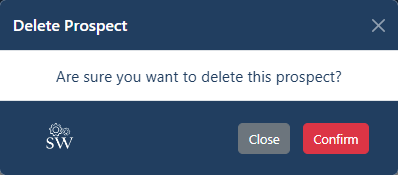

If the user confirms, two possibility are considered. The first is success when the user is authorized as an owner of the prospect or the Admin of the organization. The second case is when the action is denied if the user is neither the owner of the prospect nor the Admin. Both cases are shown below.

...

The same pattern is used to create prospect. The create prospect modal and the associated modals designed to provide responses to the result of the create action are provided below.

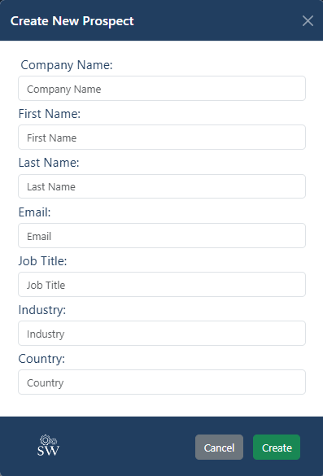

**Success Message**

**Error Message**

#### 3.3.4 Product Management

The product management provides the user the ability to read/create/edit/delete product. The product list page is the main page. It lists all the saved product.
A screenshot of the product list is provided below.

The product detail modal shows the product detail and provides the capability to edit or delete the product. A screenshot of the modal is below:

   
If a user edit a product, two cases are considered. The first case is when the entered information is correct. The second if the information entered incorrectly. In both cases, a modal message appears informing the user of the action result. An example of each case is shown below respectively.

...

If the user clicks on the delete button to delete a product, a conformation message appears asking for conformation.

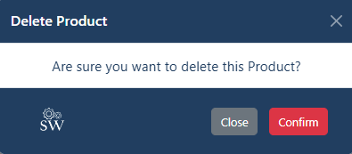

If the user confirms, two possibility are considered. The first is success when the user is authorized as an owner of the product or the Admin of the organization. The second case is when the action is denied if the user is neither the owner of the product nor the Admin. Both cases are shown below.

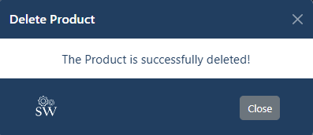

...

The same pattern is used to create product. The create product modal and the associated modals designed to provide responses to the result of the create action are provided below.

**Success Message**

**Error Message**

#### 3.3.5 Opportunity Management

The opportunity management provides the user the ability to read/create/edit/delete opportunity. The opportunity list page is the main page. It lists all the saved opportunity.

A screenshot of the opportunity list is provided below.

By clicking on the + Opportunity, the create new opportunity page opens. As shown below.

As shown above the opportunity page has multiple features. The first feature is the Sales Process Flow. This represent the four steps sales process explained in [Process layer section](/README.md#221-process). The Process is represented by a progress bar. See the chain of screenshots that show the different process step this progress bar display following the process defined in [Process layer section](/README.md#221-process).

...

...

...

...

To change The progress bar shown above to required stage, the user needs to change Sales Process Stage shown below.

There are other important features in the Opportunity create page or Opportunity detail page. These are prospect and product selection features. There, the user can select from the available records of prospects or products saved in the database. This is important in order to attach them to the opportunity, otherwise the opportunity cannot exist. See the screenshots below.

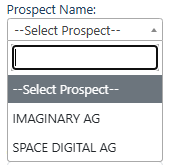

...

Another important feature is the product price. The product price field is not active. It only changes when you select a product. It then shows the price of that selected product. The rest of fields in the opportunity create/detail are self-explanatory.

when the user creates a new opportunity, a modal message pops up with a response. The response can be either success with a conformation message or fail with an error. The type of response is contingent upon providing the needed information correctly. Examples of success and fail responses are shown below.

**Success Message**

**Error Message**

The opportunity detail modal shows the opportunity detail. It provides the capability to edit or delete the opportunity. A screenshot of the modal is below:

   
If a user edit an opportunity, two cases are considered. The first case is when the entered information is correct. The second if the information is entered incorrectly. In both cases, a modal message appears informing the user of the action result. An example of each case is shown below respectively.

...

If the user clicks on the delete button to delete an opportunity, a conformation message appears asking for conformation.

If the user confirms, two possibility are considered. The first is success when the user is authorized as an owner of the opportunity or the Admin of the organization. The second case is when the action is denied if the user is neither the owner of the opportunity nor the Admin. Both cases are shown below.

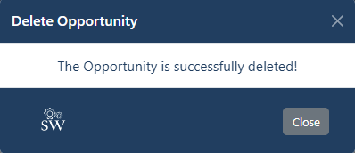

...

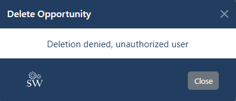

#### 3.3.6 Account Management

This subsection focuses on Account management features, namely: Sign Up, Sign In and Sign Out pages features.

1. Sign Up

The sign-up page screenshots are shown below for large and small screens respectively.

...

If the entered data is not correct, the error message will appear in RED. See the screenshots for both large and small screens.

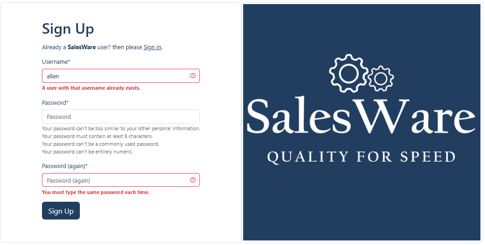

...

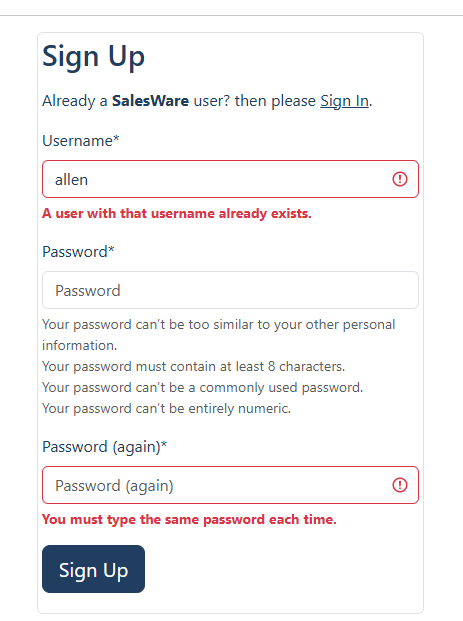

2. Sign In

The sign-in page screenshots are shown below for large and small screens respectively.

...

If the entered data is not correct, the error message will appear in RED. See the screenshots for both large and small screens.

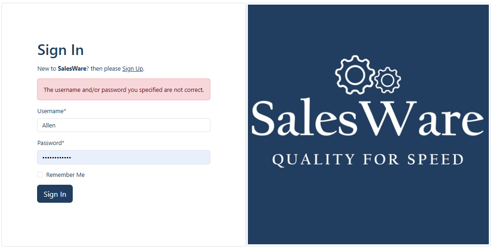

...

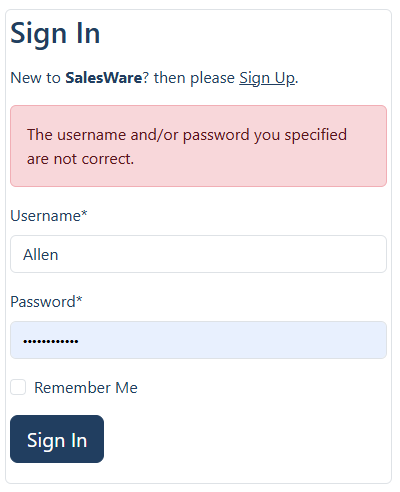

3. Sign Out

The sign-out page is accessed by clicking on the user name dropdown menu. See the two screenshots for large and small screens below.

...

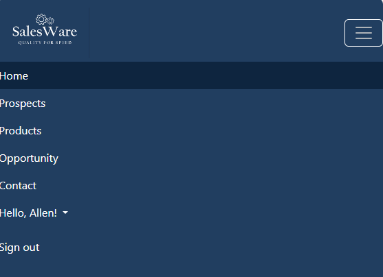

If the user clicks on the Sign Out, the sign-out confirmation page will open. Screenshots of the page for large and small screens are provided below.

...

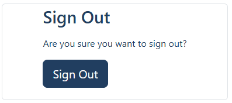

If the user clicks on Sign Out button, the user will be signed out and sent back to the home page.
This concludes the Feature subsection. The next subsection will dive into the testing activity.

---

### 3.4 Test

This subsection is divided into Four main subsections. The first subsection concerns with code quality and validation tests. The second subsection summarizes the conducted manual tests. The third section provides detailed account of all the unit tests developed for this project. Finally the Test subsection concludes with discussion on Bugs encountered during the development of this project.

#### 3.4.1 Code Quality and Validation Tests

The following table summarizes various Quality and Validation tests conducted for each code and page of SalesWare.

| No. | Test Name| Tool Name| Test Explanation| No. of Tests| Test Result| Comment|
| --- | -------- | -------- | --------------- | -------------- | ---------- | ------ |
| 1   | JavaScript code analysis | JShint|All JS files| x4| Pass. Warning: bootstrap as undefined var| Explanation: [unfixed bugs](/README.md#5411b-unfixed-bugs)|
| 2   | Python code style checker| CI Linter| Every .py file developed by the author | x31| Pass| No Comment|
| 3   | HTML Validation| W3C Markup Validation | All pages| x10| Pass| No Comment|
| 4   | CSS Validation| W3C CSS Validation| All pages| 10 + Author's CSS | 10 + Author's CSS are pass, no errors. The 10 pages show warnings| Explanation: [unfixed bugs](/README.md#5411b-unfixed-bugs)|
| 5   | Accessibility| Wave tool| All pages| x10| Pass| No Comment |
| 6   | Google DevTools| Chrome DevTools| All pages| x10|Pass|No Comment|
| 7   | Lighthouse Validation| Chrome Lighthouse| Desktop and Mobile| x20| Min value P: 83, A: 100, BP: 100, SEO = 100 |Test [screenshots](/TEST.md#lighthouse-tests-captures)|
| 8   | Browser Compatibility| NA| Edge, Chrome and Firefox| x3| Pass| No comment|
| 9   | Device Testing| NA| PC and Mobile| x2| Pass| No comment|

#### 3.4.2 Manual Tests

This subsection provides a comprehensive account of the manual test conducted for this project. The tests follow the epics structure. The tests are explained in the following table.

- Epic SW-1 Account Management
  - **User Story**: Register a User account
    - Acceptance Criteria
      - Given the visitor in the sign up page, the visitor can register and the visitor is then sent back to the home page with his name appearing as signed in on to of the dropdown menu -- Pass
  - **User Story**: Store login information
    - Acceptance Criteria
      - Given the user is signed out and on the sign in page, the visitor can sign in again and the user is then sent back to the home page with his name appearing as signed in on to of the dropdown menu -- Pass
  - **User Story**: Admin User Account
    - Acceptance Criteria
      - Given the user is registered as an Admin, the Admin can sign in into the admin page and get access to the functionality of seeing all the registered users -- Pass

- Epic SW-2 Prospect Management
  - **User Story**: Prospect Page
    - Acceptance Criteria
      - Given the user is on the home page and when clicking on the prospect link the user lands on the prospect page to see all the saved prospects -- pass
  - **User Story**: Create Prospect Entry
    - Acceptance Criteria
      - Given the user is on the prospect create modal and when entering the new prospect information and clicking on the Create button, the user receives a confirmation message informing the user that the prospect is successfully created -- pass
  - **User Story**: Open and Read Prospect Entry
    - Acceptance Criteria
      - Given the user is on the prospect page and when clicking on the prospect name, a modal opens showing the detail of that prospect -- pass
  - **User Story**: Edit Prospect Entry
    - Acceptance Criteria
      - Given the user is on the prospect detail modal and when entering the updated prospect information and clicking on the Edit button, the user receives a confirmation message informing the user that the prospect is successfully updated -- pass
  - **User Story**: Delete Prospect Entry
    - Acceptance Criteria
      - Given the user is on the prospect detail modal and when clicking on the Delete button, the user receives a confirmation message informing the user that the prospect is successfully deleted -- pass
  - **User Story**: Prospect Name Case Sensitive
    - Acceptance Criteria
      - Given the user has just successfully created a new prospect and when the user gets automatically back to the prospect list page, the user can see the new created prospect is saved in capital letters -- pass

- Epic SW-3 Product Management
  - **User Story**: Product Page
    - Acceptance Criteria
      - Given the user is on the home page and when clicking on the product link the user lands on the product page to see all the saved products -- pass
  - **User Story**: Create Product Entry
    - Acceptance Criteria
      - Given the user is on the product create modal and when entering the new product information and clicking on the Create button, the user receives a confirmation message informing the user that the product is successfully created -- pass
  - **User Story**: Open and Read Product Entry
    - Acceptance Criteria
      - Given the user is on the product page and when clicking on the product name, a modal opens showing the detail of that product -- pass
  - **User Story**: Edit Product Entry
    - Acceptance Criteria
      - Given the user is on the product detail modal and when entering the updated product information and clicking on the Edit button, the user receives a confirmation message informing the user that the product is successfully updated -- pass
  - **User Story**: Delete Product Entry
    - Acceptance Criteria
      - Given the user is on the product detail modal and when clicking on the Delete button, the user receives a confirmation message informing the user that the product is successfully deleted -- pass
  - **User Story**: Product Name Case Sensitive
    - Acceptance Criteria
      - Given the user has just successfully created a new product and when the user gets automatically back to the product list page, the user can see the new created product is saved in capital letters -- pass

- Epic SW-4 Opportunity Management
  - **User Story**: Opportunity Page
    - Acceptance Criteria
      - Given the user is on the home page and when clicking on the opportunity link the user lands on the opportunity page to see all the saved opportunities -- pass
  - **User Story**: Create Opportunity Entry
    - Acceptance Criteria
      - Given the user is on the opportunity create page and when entering the new opportunity information and clicking on the Create button, the user receives a confirmation message informing the user that the opportunity is successfully created -- pass
  - **User Story**: Open and Read Opportunity Entry
    - Acceptance Criteria
      - Given the user is on the opportunity page and when clicking on the opportunity name, a opportunity detail page opens showing the detail of that opportunity -- pass
  - **User Story**: Edit Opportunity Entry
    - Acceptance Criteria
      - Given the user is on the opportunity detail page and when entering the updated opportunity information and clicking on the Edit button, the user receives a confirmation message informing the user that the opportunity is successfully updated -- pass
  - **User Story**: Delete Opportunity Entry
    - Acceptance Criteria
      - Given the user is on the opportunity detail page and when clicking on the Delete button, the user receives a confirmation message informing the user that the opportunity is successfully deleted -- pass
  - **User Story**: Opportunity Name Case Sensitive
    - Acceptance Criteria
      - Given the user has just successfully created a new opportunity and when the user gets automatically back to the opportunity list page, the user can see the new created opportunity is saved in capital letters -- pass
  - **User Story**: Return to Opportunity list
    - Acceptance Criteria
      - Given the user has just been confirmed by the modal message that new opportunity is successfully saved and when clicks on the Close button, the user is automatically sent back to the opportunity page  -- pass
      - Given the user has just been confirmed by the modal message that updated opportunity is successfully saved and when clicks on the Close button, the user is automatically sent back to the opportunity page  -- pass
      - Given the user has just been confirmed by the modal message that opportunity is deleted and when clicks on the Close button, the user is automatically sent back to the opportunity page  -- pass
  - **User Story**: Opportunity Back Button links to Opportunity List Page
    - Acceptance Criteria
      - Given the user is on the opportunity create or detail page and when clicks on the Back button, the user is sent back to the opportunity page  -- pass
  - **User Story**: Opportunity Record Control*
    - Acceptance Criteria
      - Given the user is not the owner of the opportunity record or is not the Admin user, and when clicks on Edit or Delete button, the user is denied the action  -- pass

- Epic SW-6 Opportunity Management
  - **User Story**: Home Page
    - Acceptance Criteria
      - Given a visitor is on the home page and when scrolling over the home page, the visitor finds all the needed information to encouraged to sign up for the application -- pass
  - **User Story**: Contact Page
    - Acceptance Criteria
      - Given a visitor or a user is on any page of the application and when need to contact the SalesWare support team, the user or the visitor can go to the contact page to fill in the contact form and send it a contact request -- pass
  - **User Story**: Email Received
    - Acceptance Criteria
      - Given a visitor or a user is correctly filled out the contact form and when clicks on the Send Button, the visitor or the user receives a confirmation email that the request is received -- pass
    - **User Story**: Confirmation Modal Message
    - Acceptance Criteria
      - Given a visitor or a user is correctly filled out the contact form and when clicks on the Send Button, a modal message pops up confirming the request is submitted successfully -- pass
    - **User Story**: Contact Form Received
    - Acceptance Criteria
      - Given a visitor or a user is correctly filled out the contact form and when clicks on the Send Button, an email is sent to the author of SalesWare containing all information in the request -- pass
    - **User Story**: Link to Contact Page
    - Acceptance Criteria
      - Given a visitor or a user is on the home page and when reading about the SalesWare customization offering, the use can click on a Contact Us link beneath the text to send the visitor or the user to the contact page -- pass
    - **User Story**: Active Page
    - Acceptance Criteria
      - Given a visitor or a user is on any page of SalesWare and when the user wants to know where in the website the user or the visitor currently is, the nav bar provides a dark color signifier over the page name that the user or the visitor is currently on right now -- pass

#### 5.4.3 Automated Tests

The author developed 58 python automated tests. The coverage report is extracted and the summary is provided in the table below.

| Statements | Missing | Excluded | Coverage |
| ---------- | ------- | -------- | -------- |
| 790        | 71      | 0        | 91%      |

The tests and the results are summarized in the tables below.

**Tests on Prospect Management**

| Test No. | App Name | File Name      | Tested On Python File Name | Test Case          | Test Name                                    | Result |
| -------- | -------- | -------------- | -------------------------- | ------------------ | -------------------------------------------- | ------ |
|          | prospect |                |                            |                    |                                              |        |
|          |          | test_models.py | models.py                  |                    |                                              |        |
| 1        |          |                |                            | SuperUserModelTest | test_create_superuser                        | Pass   |
| 2        |          |                |                            | UserModelTest      | test_create_user                             | Pass   |
| 3        |          |                |                            | ProspectModelTest  | test_create_prospect_models                  | Pass   |
| 4        |          |                |                            |                    | test_meta_ordering_method_of_prospect_models | Pass   |
| 5        |          |                |                            |                    | test_str_method_of_prospect_models           | Pass   |
| 6        |          |                |                            |                    | test_upper_case_converter_on_prospect_models | Pass   |
|          |          | test_urls.py   | urls.py                    |                    |                                              |        |
| 7        |          |                |                            | TestProspectUrls   | test_prospect_list_url                       | Pass   |
| 8        |          |                |                            |                    | test_prospect_detail_url                     | Pass   |
| 9        |          |                |                            |                    | test_prospect_create_url                     | Pass   |
| 10       |          |                |                            |                    | test_prospect_edit_url                       | Pass   |
| 11       |          |                |                            |                    | test_prospect_delete_url                     | Pass   |
|          |          | test_forms.py  | forms.py                   |                    |                                              |        |
| 12       |          |                |                            | TestProspectForm   | test_prospect_form_is_valid                  | Pass   |
| 13       |          |                |                            |                    | test_prospect_form_is_not_valid              | Pass   |
| 14       |          |                |                            |                    | test_prospect_form_is_not_valid_empty_field  | Pass   |
|          |          | test_views.py  | views.py                   |                    |                                              |        |
| 15       |          |                |                            | TestProspectViews  | test_prospect_list_view                      | Pass   |
| 16       |          |                |                            |                    | test_prospect_detail_view                    | Pass   |
| 17       |          |                |                            |                    | test_prospect_create_view                    | Pass   |
| 18       |          |                |                            |                    | test_prospect_edit_view                      | Pass   |
| 19       |          |                |                            |                    | test_prospect_delete_view                    | Pass   |

...

**Tests on Product Management**

| Test No. | App Name | File Name      | Tested On Python File Name | Test Case        | Test Name                                   | Result |
| -------- | -------- | -------------- | -------------------------- | ---------------- | ------------------------------------------- | ------ |
|          | product  |                |                            |                  |                                             |        |
|          |          | test_models.py | models.py                  |                  |                                             |        |
| 20       |          |                |                            | ProductModelTest | test_create_product_models                  | Pass   |
| 21       |          |                |                            |                  | test_meta_ordering_method_of_product_models | Pass   |
| 22       |          |                |                            |                  | test_str_method_of_product_models           | Pass   |
| 23       |          |                |                            |                  | test_product_price_method_of_product_models | Pass   |
| 24       |          |                |                            |                  | test_upper_case_converter_on_product_models | Pass   |
|          |          | test_urls.py   | urls.py                    |                  |                                             |        |
| 25       |          |                |                            | TestProductUrls  | test_product_list_url                       | Pass   |
| 26       |          |                |                            |                  | test_product_detail_url                     | Pass   |
| 27       |          |                |                            |                  | test_product_create_url                     | Pass   |
| 28       |          |                |                            |                  | test_product_edit_url                       | Pass   |
| 29       |          |                |                            |                  | test_product_delete_url                     | Pass   |
|          |          | test_forms.py  | forms.py                   |                  |                                             |        |
| 30       |          |                |                            | TestProductForm  | test_product_form_is_valid                  | Pass   |
| 31       |          |                |                            |                  | test_product_form_is_not_valid              | Pass   |
| 32       |          |                |                            |                  | test_product_form_is_not_valid_empty_field  | Pass   |
|          |          | test_views.py  | views.py                   |                  |                                             |        |
| 33       |          |                |                            | TestProductViews | test_product_list_view                      | Pass   |
| 34       |          |                |                            |                  | test_product_detail_view                    | Pass   |
| 35       |          |                |                            |                  | test_product_create_view                    | Pass   |
| 36       |          |                |                            |                  | test_product_edit_view                      | Pass   |
| 37       |          |                |                            |                  | test_product_delete_view                    | Pass   |

...

**Tests on Opportunity Management**

| Test No. | App Name    | File Name      | Tested On Python File Name | Test Case            | Test Name                                             | Result |
| -------- | ----------- | -------------- | -------------------------- | -------------------- | ----------------------------------------------------- | ------ |
|          | opportunity |                |                            |                      |                                                       |        |
|          |             | test_models.py | models.py                  |                      |                                                       |        |
| 38       |             |                |                            | OpportunityModelTest | test_create_opportunity_models                        | Pass   |
| 39       |             |                |                            |                      | test_upper_case_converter_on_opportunity_models       | Pass   |
| 40       |             |                |                            |                      | test_winning_probability_method_of_opportunity_models | Pass   |
| 41       |             |                |                            |                      | test_estimation_of_opportunity_models                 | Pass   |
|          |             | test_urls.py   | urls.py                    |                      |                                                       |        |
| 42       |             |                |                            | TestOpportunityUrls  | test_opportunity_list_url                             | Pass   |
| 43       |             |                |                            |                      | test_opportunity_detail_url                           | Pass   |
| 44       |             |                |                            |                      | test_opportunity_create_url                           | Pass   |
| 45       |             |                |                            |                      | test_opportunity_edit_url                             | Pass   |
| 46       |             |                |                            |                      | test_opportunity_delete_url                           | Pass   |
|          |             | test_forms.py  | forms.py                   |                      |                                                       |        |
| 47       |             |                |                            | TestOpportunityForm  | test_opportunity_form_is_valid                        | Pass   |
| 48       |             |                |                            |                      | test_opportunity_form_is_not_valid                    | Pass   |
| 49       |             |                |                            |                      | test_opportunity_form_is_not_valid_empty_field        | Pass   |
|          |             | test_views.py  | views.py                   |                      |                                                       |        |
| 50       |             |                |                            | TestOpportunityViews | test_opportunity_list_view                            | Pass   |
| 51       |             |                |                            |                      | test_opportunity_detail_view                          | Pass   |
| 52       |             |                |                            |                      | test_opportunity_create_view                          | Pass   |
| 53       |             |                |                            |                      | test_opportunity_edit_view                            | Pass   |
| 54       |             |                |                            |                      | test_opportunity_delete_view                          | Pass   |

...

**Tests on Communication Management**

| Test No. | App Name      | File Name     | Tested On Python File Name | Test Case              | Test Name         | Result |
| -------- | ------------- | ------------- | -------------------------- | ---------------------- | ----------------- | ------ |
|          | communication |               |                            |                        |                   |        |
|          |               | test_urls.py  | urls.py                    |                        |                   |        |
| 55       |               |               |                            | TestCommunicationUrls  | test_home_view    | Pass   |
| 56       |               |               |                            |                        | test_contact_view | Pass   |
|          |               | test_views.py | views.py                   |                        |                   |        |
| 57       |               |               |                            | TestCommunicationViews | test_home_view    | Pass   |
| 58       |               |               |                            |                        | test_contact_view | Pass   |

--- 

#### 3.4.4 Bugs

This subsection provides detailed explanation on Bugs identified during the development SalesWare. It is divided into two sections. The first treat the Fixed bugs while the second is devoted to list and explain the unfixed bugs.

##### 3.4.4.1 Fixed Bugs

This section lists the bugs that are identified and fixed during the development.

| Bug ID No. | Bug Position | Bug Description | Bug Solution |
| ---------- | ------------ | --------------- | ------------ |
| 1| Prospect/product/opportunity views.py| save prospect/product id when prospect detail modal is called, and passing it to the edit/delete views.py| Use request.session to get the id, then store it to be used in the edit/delete view functions |
| 2| Prospect/product/opportunity views.py| Extracting error code for evaluation| Use errors.as_data().items() method and loop through errors and get the error.code|
| 3| Prospect/product/opportunity js files| If Close button and X symbol close are clicked to cancel edit/delete action the modal data does not reset | Use event listener and execute location.reload() method|
| 4| Opportunity js file with opportunity create template | product price is null when open opportunity create page. This leads to console error| Add condition if product price null then define product value as an empty value to prevent error|
| 5| Contact js file| No Modal message response appears if only spaces are entered to the form fields. HTML required attribute does not handel this issue properly| Add else to the if statement of "form is valid" with a response message to inform the user|

##### 3.4.4.2 Unfixed Bugs

This section lists the bugs that are identified and not fixed. Most of those bugs are not errors but rather alerts or warnings.Related screenshots and further information can be found in

| Bug ID No. | Bug Position | Bug Description | Comment |
| ---------- | ------------ | --------------- | ------- |
| 1| contact.js| JSHint observes bootstrap.Modal as undefined variable| This due to JSHint does not import Bootstrap CDN. No solution is suggested|
| 2| Sign Up page| Four errors are identified by the HTML validator| The errors are originated by **django-allauth** package itself. These errors frequently appear on other CI student PP4 projects. One of Slack members indicates that this issue appears in the newer versions of **django-allauth** packages that are above .55. Please refer to [the HTML Validation Selected Test Screenshot ](/TEST.md#html-validation-selected-test-screenshot) for more information|
| 3| All pages| CSS Validation warnings appear on every page of SalesWare| Those warnings come from **Bootstrap package**. The CSS file developed by the author ofin this project is validated. Neither errors nor warnings are identified |
| 4| Home Page| Wave tool shows Redundant link alert. This is related to having two links to the contact page in the home page| The author has no solution to this alert at point|
| 5| Opportunity Create Page | Wave tool shows Page shows 2 X Redundant title text alerts. This is related to **jQuery select2**. It seems **jQuery select2** automatically produces titles that trigger this alert | The author has no solution to this alert at this point because the author does not have direct access to internal code of **jQuery select2** method|        

---

## 6 Deployment

This section is devoted to explain the procedures conducted by the author to deploy and clone SalesWare code. Additionally, for those who are interested to create a fork from the main branch, a dedicated procedure is also provided.

### 6.1 Heroku

The following procedure is implemented to deploy SalesWare on Heroku platform:

1. Create a list of requirements/dependencies for Software. In order to that, the following steps is to be executed:
    - Go to the command line terminal of the development environment (Gitpod)
    - Type "pip3 freeze > requirements.txt" (requirements.txt is the file where the list of requirements is stored)
    - Add this change and commit it
    - Push the change to the GitHub repository
2. Sign in to Heroku account 
3. On Heroku dashboard, click on "Create a new app" button
4. Within the "Create New App" window, go to the "App name" input field and type in an App name
5. Within the same window, choose your region from the "Choose region" dropdown menu
6. Click on "Create app" button
7. New window opens for the App that is just created
8. Within this window, from the 7 taps available, select "Settings"
9. Within the setting tap window, go to "Confg Vars"
10. Click on "Create Confg Vars"
11. Two input fields appear, one for key and one for value
    - Within the "key" input field add the key variable name
    - Within the "value" field add the key corresponding value
    - Click on "Add"
12. Scroll down to "Buildpacks", within the Buildpacks, follow the listed sub-steps below:
    - Click on "Add buildpacks"
    - A "Add buildpack" window opens
    - From the list, choose "Python" first
    - Click on "Save changes" button
    - From the same list, choose "nodejs" second
    - Click on "Save changes" button
    - Ensure Keeping the order packs as described in last 4 sub-steps
13. Now go to the "Deploy" tap right at the top of the window
14. Within the "Deployment method" row, click on "GitHub" button
15. Within the "Connect to GitHub" (One row down the Deployment method) click on "Connect to GitHub"
16. Wait a bit for loading
17. Now on the same row and within the search field, type the name of the project repository and click on "Search" button
18. Now click connect
19. Once it is connected to the project repository, scroll down to "Manual Deploy"
20. Within this row, click on "Deploy Branch"
21. Once the deploy log is finished, a message appears and hopefully says: "You app was successfully deployed"
22. Below it a "View" button appears as well
23. Click on the "View" to open the deployed project on a new browser tap 

**Note: Throughout the development, the author chooses only the manual deployment.**

### 6.2 GitHub

The following procedure is followed to create the software repository

1. Go to your repositories 
2. Open CI P3-template
3. On the top right, click on "Use this template"
4. Click on "Create a new repository"
5. New window opens
6. In the field of "Repository name" type the project name
7. Choose public
8. Then click on "Create repository"

### 6.3 Clone into Gitpod

The following procedure is implemented to clone from the GiTHub repo into Gitpod:

1. Go to the "code" in the upper right corner
2. Select "local" 
3. Select "Clone/HTTPs"
4. Copy the url provided
5. Open new browser tap
6. Open your Gitpod Workspace
7. Click on "Create new workspace"
8. Click on "select new Repository"
9. Paste the url in input window
10. Click continue

### 6.4 Fork

For any person interested to work on the source code of this project, here is the procedure that needs to be followed to make a fork.

1. Go to ahmedcodein repositories
2. Click on "salesware" repo
3. In the upper right corner, click of "fork" drop down menu
4. Click on "create new fork"
5. Create new fork window opens
6. Select the "owner" of the repo
7. Add a name to "Repository name"
8. Add a description to the "Description" field if needed
9. Click on "Create fork "

## 7 Future Work

SalesWare is a sales module of a larger Customer Relation Management Solution. Therefore, the long term objective of this project is to extend this project to include Marketing, Customer Service, Customer Support and Customer Data modules.

With respect to the short and midterm features, there is simply no limit as to what features can be included into SalesWare. This is because Sales Activity involves numerous metrics and details. Those can be reflected into SalesWare to make it more valuable to any Sales Team. For instance, additional fields could be added to the prospect, product and opportunity models. There is no limitation as to what fields should be added. So the question is should the author add those fields? The author believes this question should be left to the early adopters of SalesWare to answer. The best feature to develop is the one that the customer asks for. SalesWare at its current state aims to get the author at the door step of potential users and start collecting those important first-to-develop features.

Nevertheless, here are some of the features that the author thinks are important and could be developed in the meantime.

1. Sales Funnel to track expected revenue at the end of each fiscal quarter or by the end of each fiscal year.
2. Sales revenue estimation by country.
3. Sales revenue estimation by industry.
4. Data Analytics to provide additional value to the user. For instance, having data about how much time in average is required to acquire a customer from the time of creating the Lead up to the time of Closing the opportunity, i.e, the Close stage. 

The first three points could be included in a new app called Dashboard. While the fourth could be implemented in a new app dedicated for data analytics. **It is worth noting here that SalesWare Models today support such extensions. Wheres the author considered them already when developing the models from day one**.

## 8 Credits

### 8.1 References

- CI Study Materials, [Code Institute](https://codeinstitute.net/de/bildungsgutschein/?utm_term=code%20institute&utm_campaign=CI%2B-%2BUK%2B-%2BSearch%2B-%2BBrand&utm_source=adwords&utm_medium=ppc&hsa_acc=8983321581&hsa_cam=16493764737&hsa_grp=132915436966&hsa_ad=635790877675&hsa_src=g&hsa_tgt=kwd-319867646331&hsa_kw=code%20institute&hsa_mt=e&hsa_net=adwords&hsa_ver=3&gad_source=1&gclid=Cj0KCQjw3tCyBhDBARIsAEY0XNlk5PQerlGAVupYRw0WPKtdiPb9QBFPzUv-YEGIv5cb6FJe1G24uVwaAoZKEALw_wcB).

- EmailJS, [EmailJS documentation](https://www.emailjs.com/docs/).
- Django, [Django documentation](https://docs.djangoproject.com/en/5.1/).
- The Dumbfounds, [Django Testing Tutorial](https://www.youtube.com/watch?v=qwypH3YvMKc&list=PLbpAWbHbi5rMF2j5n6imm0enrSD9eQUaM).
- Markdown Cheat Sheet, [Markdown Guide](https://www.markdownguide.org/cheat-sheet/).
- Conventional Commits, [A specification for adding human and machine readable meaning to commit messages](https://www.conventionalcommits.org/en/v1.0.0/).
- Hoberman, Steve, Michael Blaha, Bill Inmon, Graeme Simsion, and Carol Lehn. Data modeling made simple: a practical guide for business and IT professionals. Technics Publications, LLC, 2009.
- Czarnecki, Christian, and Christian Dietze. "Reference architecture for the telecommunications industry." Transformation of Strategy, Organi-zation, Processes, Data, and Applications (2017).

### 8.2. Content and Tools

- [ChatGPT](https://chat.openai.com/auth/login?sso) is used to understand various programming concepts.
- [Google Gemini](https://gemini.google.com/) is used to understand various programming concepts.
- [Word counter](https://wordcounter.net/character-count) is used to track the number of characters of each git commit.
- [Image Resizer](https://redketchup.io/image-resizer) is used to resize images.
- [Lucid](https://lucid.app/documents#/documents?folder_id=home) is used to create the Conceptual Data Model and the Business Process.
- [Balsamiq Wireframes for Desktop](https://balsamiq.com/wireframes/desktop/) is used to create the Wireframes.
- [Coolors](https://coolors.co/fdf6da-dcbf87-dcb36f-ac8144-744b1e-704116-6b350f-210e03) is used to create the color palette.
- [Contrast Grid](https://contrast-grid.eightshapes.com/?version=1.1.0&background-colors=&foreground-colors=%23fdf6daff%3B%0D%0A%23dcbf87ff%3B%0D%0A%23dcb36fff%3B%0D%0A%23ac8144ff%3B%0D%0A%23744b1eff%3B%0D%0A%23704116ff%3B%0D%0A%236b350fff%3B%0D%0A%23210e03ff%3B%0D%0A&es-color-form__tile-size=compact&es-color-form__show-contrast=aaa&es-color-form__show-contrast=aa&es-color-form__show-contrast=aa18&es-color-form__show-contrast=dnp) is used to create the color contrast matrix.
- [Favicon Generator](https://www.favicon.cc/?) is used to create SalesWare favicon.
- [Looka](https://looka.com/) is inspired the design concept of SalesWare logos and the teaser image in the home page.
- [GIMP GNU Image Manipulation Program](https://www.gimp.org/) is used to design and create SalesWare logos and the teaser image in the home page.
- [Leonardo](https://app.leonardo.ai/) is used to create two images of the fist part of the home page.

## 9 Acknowledgements

I would like to express my sincere gratitude to Mr. David Bowers for his outstanding mentorship. His follow up and the provision of additional time to answer questions are extraordinary. He is always available to offer help in finding solutions. His recommendations on further readings on a variety of related topics are so much appreciated and always spot on in terms of timing of sharing those recommendations. Those spectacular traits of Mr. Bowers comes only second to his genuine passion of helping others to succeed. The PP4 is my last project under his mentorship, I truly hope that we cross paths again in the near future. 
Finally, I would also like to thank my family for helping me throughout this project by providing the continuous encouragement and with the valuable help with the manual testing.
