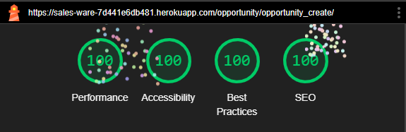
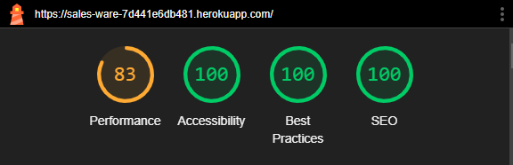
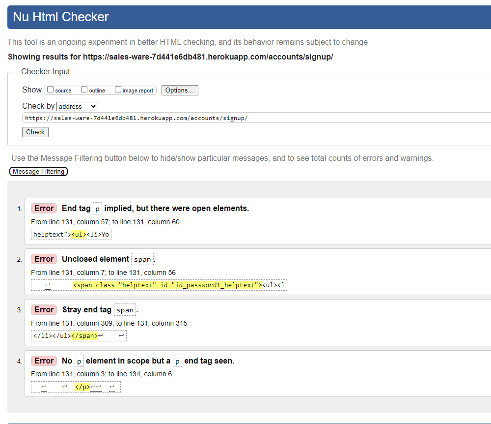

**Tests Captures**

# Lighthouse Tests Captures

## Lighthouse Desktop

### Communication Management

**Home Page**


**Contact Page**


### Prospect Management 

**Prospect Page**


### Prospect Management

**Product Page**


### Opportunity Management 

**Opportunity List Page**


**Opportunity Create Page**



**Opportunity Detail Page**


### Account Management

**Sign Up Page**


**Sign In Page**


**Sign Out Page**


## Lighthouse Mobile

### Communication Management

**Home Page**



**Contact Page**


### Prospect Management 

**Prospect Page**


### Prospect Management

**Product Page**


### Opportunity Management 

**Opportunity List Page**


**Opportunity Create Page**


**Opportunity Detail Page**


### Account Management

**Sign Up Page**


**Sign In Page**


**Sign Out Page**


# Wave Accessibility Tool

The first tests conducted by using the Wave tool show on every page an alert. The screenshot of the alert is shown below.


The alert reference is provided in the screenshot below.


The author added **#** after the home page url. This seems to be an effective solution. The alert is cleared from all the pages. See the screenshot below.

> Note: The solution to the Redundant Link Alert  is found by looking at other CI student projects. Then the author tested those projects with Wave tool. Some projects do not produce such alert. In one of those projects, namely: [TaskFlow](https://github.com/leonp84/code-institute-project-4?tab=readme-ov-file), the author noticed that the developer of TaskFlow added **#** at the end of the home page url. The author put this # into the home page url and then tested the page again with Wave tool. The author found out that this action resolves the issue.


In addition to Redundant Link Alert, the opportunity create page had two additional alerts both with the same reference. The report is provided below.


The additional Alerts reference is shown below.


The author resolves the issue by removing the automatically invoked title attribute of **jQuery select2** using Javascript in opportunity.js file. The result of the test is shown below. Notice that the three alerts are removed now. The first one by using the earlier explained approach, that is of using **#** on the page url. The other two alerts by using JavaScript remove attribute.


# HTML Validation Selected Test Screenshot

The first test of the Sign Up page using HTML returns the following errors.



As the reader can see the errors are related to a code that comes with django-alluath package. The author extracted the code using the "view source code ". The code is then analyzed by extracting the defected code to see if one can identify any issue. The code is provided below.

```
                                <p>
                                    <label for="id_password1">Password:</label>
                                    <input type="password" name="password1" placeholder="Password"
                                        autocomplete="new-password" required aria-describedby="id_password1_helptext"
                                        id="id_password1">
                                    <span class="helptext" id="id_password1_helptext">
                                        <ul>
                                            <li>Your password can’t be too similar to your other personal information.
                                            </li>
                                            <li>Your password must contain at least 8 characters.</li>
                                            <li>Your password can’t be a commonly used password.</li>
                                            <li>Your password can’t be entirely numeric.</li>
                                        </ul>
                                    </span>
                                </p> 

```

The author could not identify a clear source for the errors in the above code. However, when the the author removed the defected code from the entire source code and then pasted the cleaned code again into the HTML validator, all errors disappear.

Seeking the remove of this error, multiple approaches are evaluated. The use of crispy forms, however, proves to be helpful. The result of the validation shows no errors after implementing crispy form. A screenshot of the html validator after implementing the crispy form is provided below.


---
[Go Back](README.md)