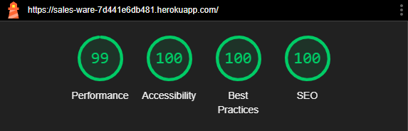
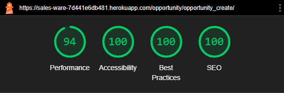

**Tests Captures**

# Lighthouse Tests Captures

## Lighthouse Desktop

### Communication Management

**Home Page**



**Contact Page**


### Prospect Management 

**Prospect Page**


### Prospect Management

**Product Page**


### Opportunity Management 

**Opportunity List Page**


**Opportunity Create Page**


**Opportunity Detail Page**


### Account Management

**Sign Up Page**


**Sign In Page**


**Sign Out Page**


## Lighthouse Mobile

### Communication Management

**Home Page**


**Contact Page**


### Prospect Management 

**Prospect Page**


### Prospect Management

**Product Page**


### Opportunity Management 

**Opportunity List Page**


**Opportunity Create Page**



**Opportunity Detail Page**


### Account Management

**Sign Up Page**


**Sign In Page**


**Sign Out Page**


# Wave Accessibility Tool

The Wave tool shows on every page an alert. The screenshot of the alert is shown below.


The alert reference is provided in the screenshot below.


In addition to Redundant Link Alert, the opportunity create page has two additional alert with the same reference. The report is provided below.


The additional Alerts has the following explanation.


# HTML Validation Selected Test Screenshot

The test of the Sign Up page using HTML returns the following errors.


As the reader can see the errors are related to a code that comes with django-alluath package. The author extracted the code using the "view source code ". The code is then analyzed by extracting the defected code to see if one can identify any issue. The code is provided below.

```
                                <p>
                                    <label for="id_password1">Password:</label>
                                    <input type="password" name="password1" placeholder="Password"
                                        autocomplete="new-password" required aria-describedby="id_password1_helptext"
                                        id="id_password1">
                                    <span class="helptext" id="id_password1_helptext">
                                        <ul>
                                            <li>Your password can’t be too similar to your other personal information.
                                            </li>
                                            <li>Your password must contain at least 8 characters.</li>
                                            <li>Your password can’t be a commonly used password.</li>
                                            <li>Your password can’t be entirely numeric.</li>
                                        </ul>
                                    </span>
                                </p> 

```

The author could not identify a clear indication of an error in the above code. However, when the the author removed removed the defected code from the entire source code then pasted the cleaned code again into the HTML validator, all errors disappear.

---
[Go Back](README.md)